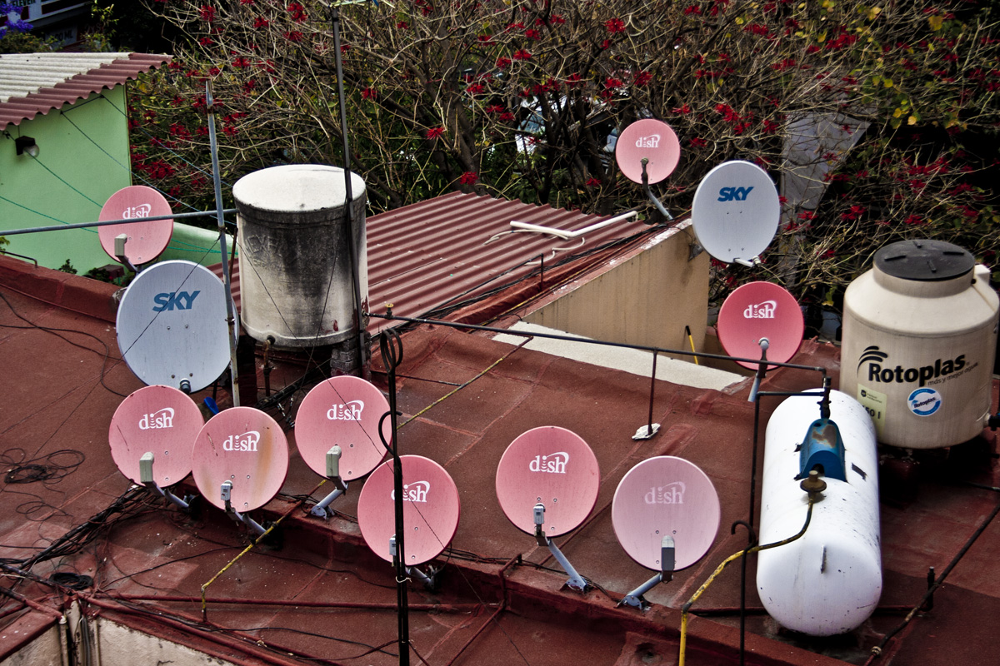
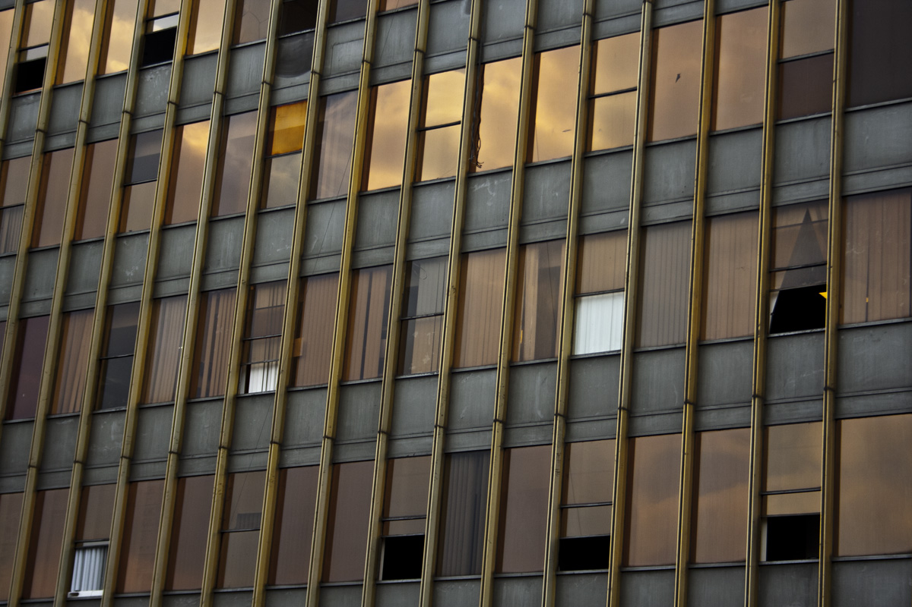
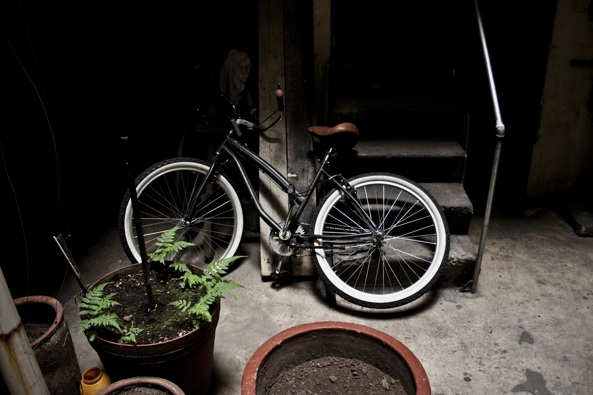
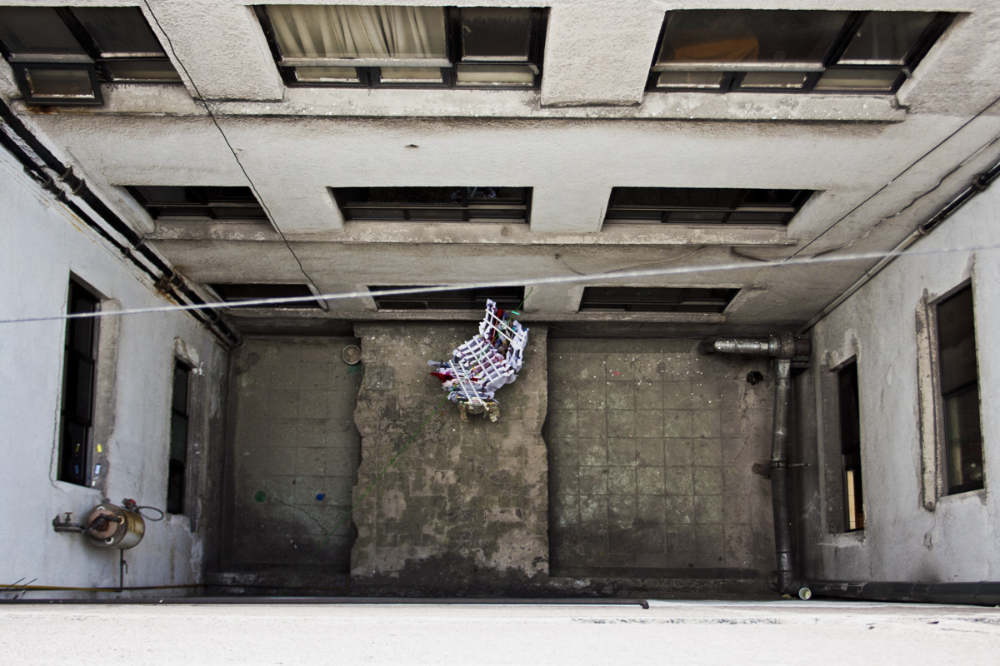
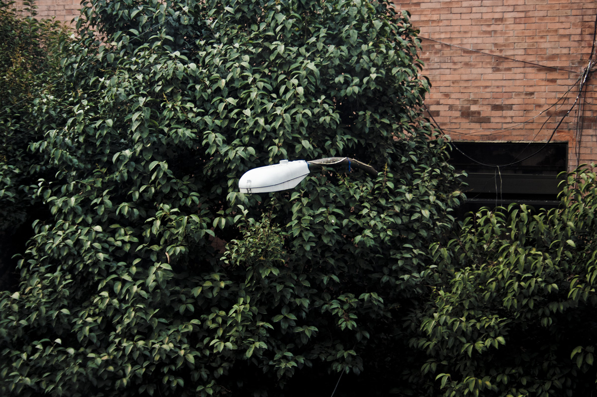

Colonia Juárez is in interesting place. Within it is Zona Rosa, an old tourist district mixed with Korean community, gay & trans culture, amidst the financial district and much more. It has many of the city’s major avenues bordering and cutting through the neighborhood, and is in between the hipster, yuppie and cultural hub of the city. To say the least, there is a lot going on.

I lived near and in Colonia Juárez for just about year, and I do not claim to know much. One thing I do know is walking down the streets I saw many condemned and vacant buildings steps away from my doorsteps, much of which was a result from the 1985 earthquake. I saw waiters and workers travel hours to sell their services in a neighborhood that I was privileged enough to afford. I saw Godínez running to work every morning to fill the cubicles of the high-rises on Reforma, and the elite driving their sports cars down the avenues, to show everyone they could.

I cannot begin to imagine what is going on now. I cannot visualize what the neighborhood I know looks like now. Blocks away, I know there are collapsed buildings. I know there are people I saw everyday whose lives have been devastated. All my friends I have are safe, but they are still living amongst the ruble. They are volunteering, but there is much to repair. It will not be solved in a week, nor a month. This will not be solved until the corruption comes to an end.

From what I’ve been hearing, nobody is quiet sure what to do, and maybe not sure what to think or how to handle the situation.

I feel hopeless. I feel privileged. This is the moment where I know I can, and did return to the United States. I have done nothing but feel safe in Colorado. I feel guilty, but I know guilt brings nothing. All I know to offer are a few photos of my everyday while living there. I don’t know how to feel.

If you are interested in donating to help Mexico City recover from the recent earthquake I would like to recommend this link to the volunteer rescue brigade “Topos” – [www.topos.mx](http://www.topos.mx)

