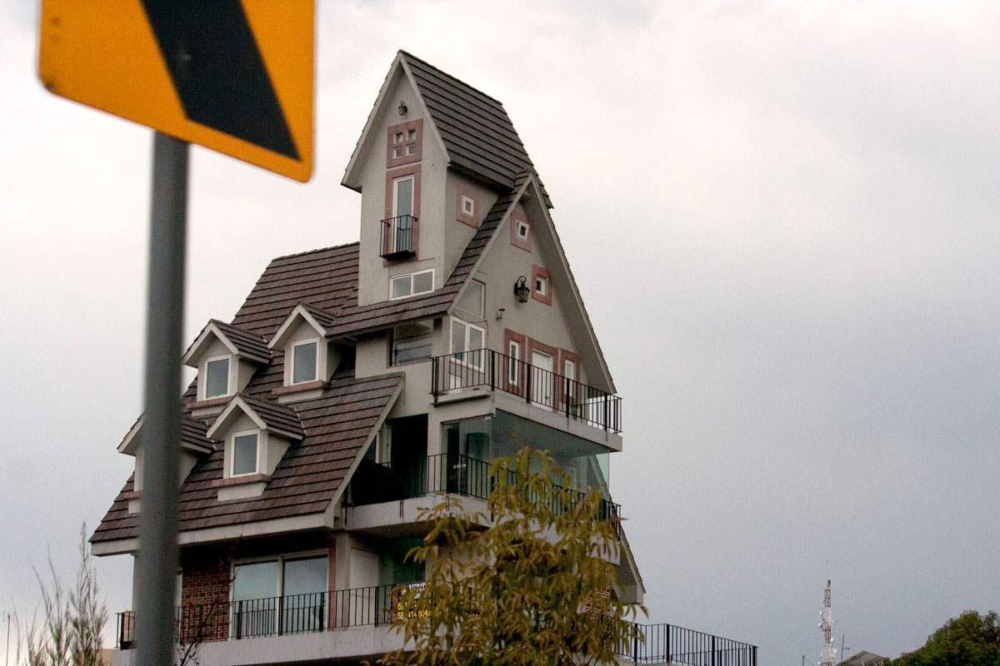
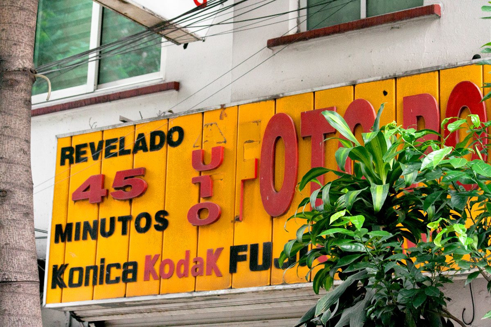
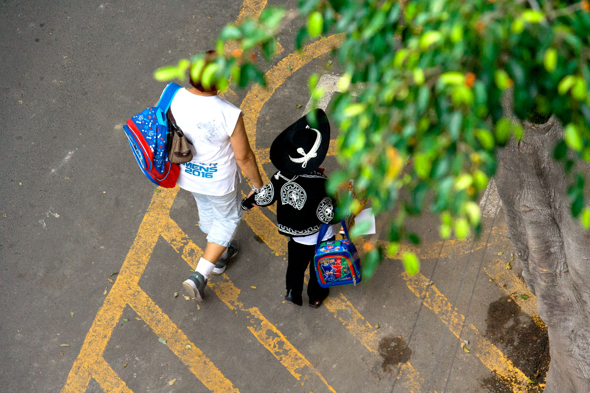
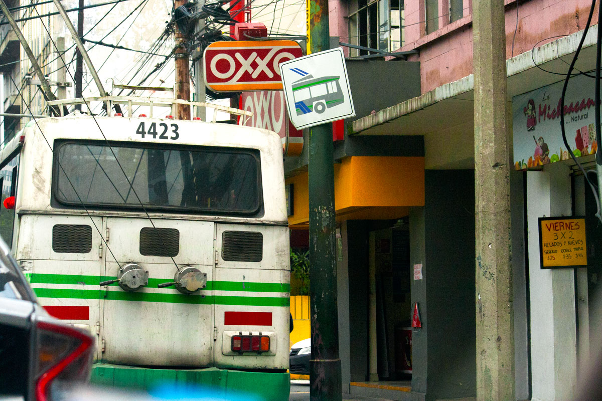
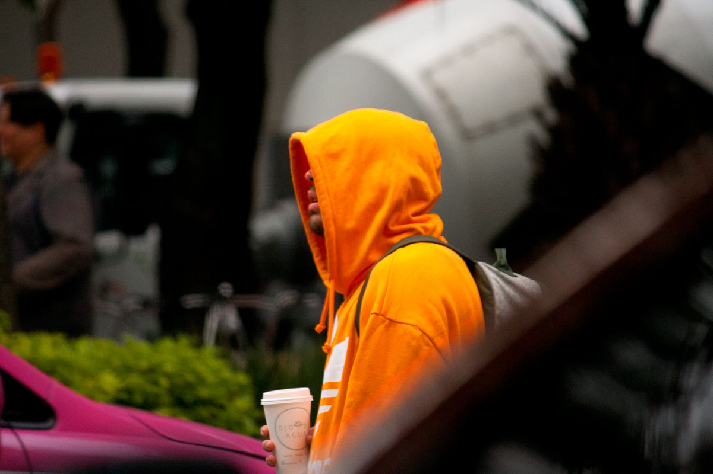

It has been almost a year since I have posted something formally on my blog. I have been taking photos regularly but have not had the desire to sit down and edit; mostly from hesitation when I moved back to Denver and immediately had a solo show at OKHI. That was a year and a half ago, and this is now, and now I’m back in Denver.

This small series broke many personal rules I’ve been holding onto since college:

+ • Never photograph people
+ • Editing is subtractive
+ • Take the subject out of context

---

This is not a new direction, but more of a tearing down of walls. It’s not only about architecture, or desired aesthetics; it’s about everyday experience. This time returning to Mexico City, I was not focused on my identity, or discovering something new, I was there to be home; to be in the chaos and enjoy the rawness. I didn’t want it to be over-curated or polished. Somehow it still has a loose connection of allowing things to get in the way with cautionary yellows and light oranges stealing the focus. They’re still all center compositions though, deal with it.

---

I cannot find this building anywhere online, but I know it’s viewable from the highway from la Juarez to Polanco.

I never developed film in México, but I am REALLY happy there are so many places that still exist.

That mariachito did not want to go wherever his mom was taking him. I remember those days.

I always forget Mexico City has electric buses.

Ojo de Agua.