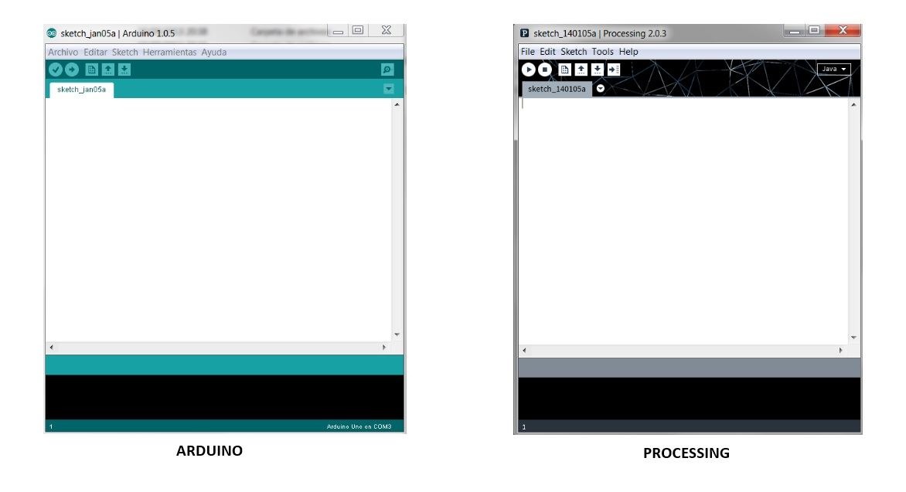
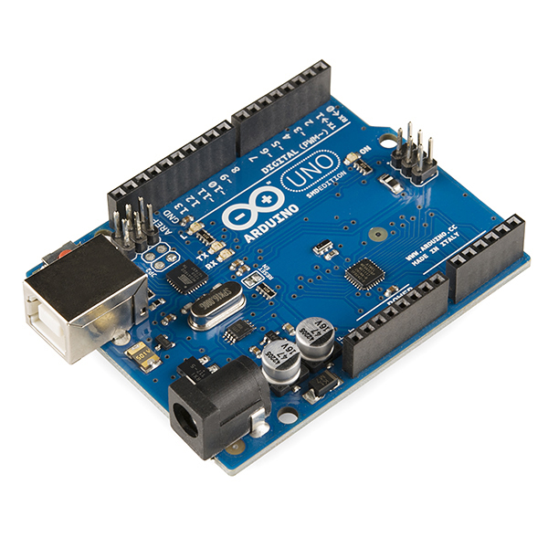

### What is P5.js?

[P5.js](https://p5js.org/) is a JavaScript library that allows Processing to be displayed in web browsers.

---

### Ok, So What Is Processing?

Processing is a language and IDE for learning how to code within the context of the visual arts based in Java. It was originally built for the electronic arts, new media art, and visual design, at MIT Media Lab by two amazing dudes named [Casey Reas](https://en.wikipedia.org/wiki/Casey_Reas) and [Benjamin Fry](https://en.wikipedia.org/wiki/Ben_Fry). If you are into new media art they are worth checking out. The basic premise of Processing was to give non-programmers instant visual feedback so they could see what they are doing.

Processing is also is the basis for the Arduino IDE.

---

### Damn It Ethan! What is Arduino?

[Arduino](https://en.wikipedia.org/wiki/Arduino) is a company and IDE and lots of stuff, but basically it’s a low-cost microcontroller for building digital devices that interact in the physical world. You can connect this with pretty much anything electronic like speakers, lights, sensors, motors, etc and write code to control and interact with electronic things. Here’s a photo of one now…

---

### So What Are You Getting At?

Ok, so I learned how to code with Processing in art school. It was really basic stuff. A few `for loops` and `if statements`, but it taught me how basic logic works. Needing to type “make the background [this] when you click on [that]” changes the way you think about stuff. When I wanted to start building websites it was simply learning the syntax of the language.

At the end of the day I still think of myself as a designer, but I know that I can code a solid website using my knowledge of HTML, CSS, Javascript and PHP. All of that came from learning a tiny bit of Processing, and now here I am putting that back into my web stuff with a javascript library. I know there are better animation libraries like Two.js and Paper.js, among many many others, but these are my roots. This is how I first learned to code, and if I can take that knowledge and apply it inside a browser I think that’s pretty damn nice.

Ok, enough about me, keep scrolling…

---

### Can I Just See The Cool Animations?

Yea, sure. Here you go. Just know the moral of the story is you can write a few lines of code and make something pretty cool looking.

<iframe height='380' scrolling='no' title='P5.js - Lines_01' src='//codepen.io/ethanethan/embed/WppbxO/?height=265&theme-id=0&default-tab=js,result' frameborder='no' allowtransparency='true' allowfullscreen='true' style='width: 99.9%;'>See the Pen <a href='https://codepen.io/ethanethan/pen/WppbxO/'>P5.js - Lines_01</a> by Ethan Barrett (<a href='https://codepen.io/ethanethan'>@ethanethan</a>) on <a href='https://codepen.io'>CodePen</a>.
</iframe>

<iframe height='380' scrolling='no' title='P5.js - Pattern_01' src='//codepen.io/ethanethan/embed/EWWaBY/?height=265&theme-id=0&default-tab=js,result' frameborder='no' allowtransparency='true' allowfullscreen='true' style='width: 99.9%;'>See the Pen <a href='https://codepen.io/ethanethan/pen/EWWaBY/'>P5.js - Pattern_01</a> by Ethan Barrett (<a href='https://codepen.io/ethanethan'>@ethanethan</a>) on <a href='https://codepen.io'>CodePen</a>.
</iframe>
